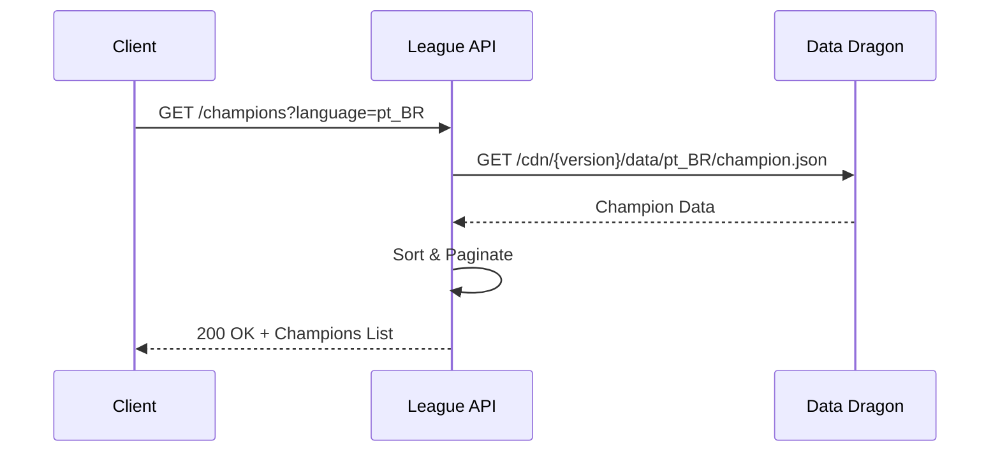
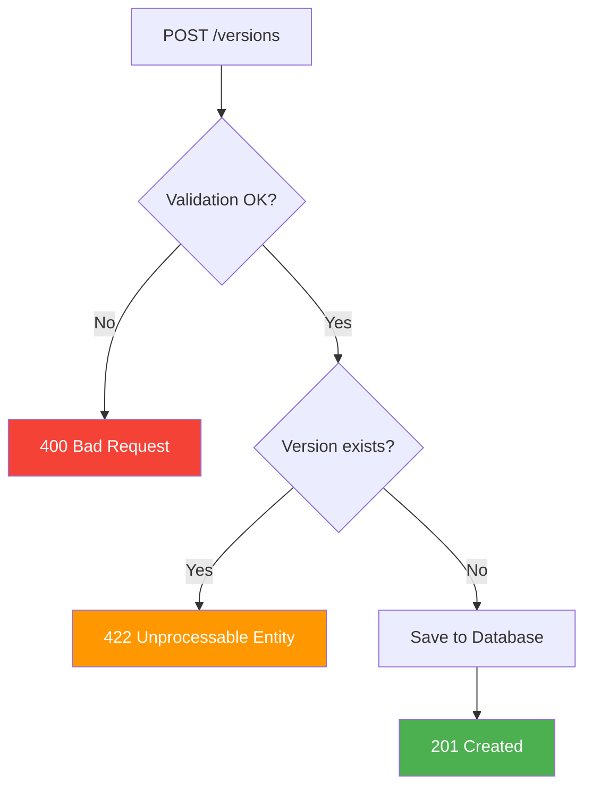

# 📚 Referência da API

Documentação completa dos endpoints da **League of Legends API**.

---

## 📋 Índice

- [Visão Geral](#-visão-geral)
- [Base URL](#-base-url)
- [Autenticação](#-autenticação)
- [Endpoints](#-endpoints)
  - [Campeões](#-campeões)
  - [Versões](#-versões)
- [Códigos de Erro](#-códigos-de-erro)
- [Exemplos](#-exemplos)

---

## 🎯 Visão Geral

Esta API fornece acesso aos dados de campeões e versões do League of Legends, consumindo a Data Dragon API da Riot Games.

### Características

| Feature | Descrição |
|---------|-----------|
| **Formato** | JSON |
| **Versionamento** | Via URL (`/api/v1/`) |
| **Paginação** | Query parameters |
| **Idiomas** | Suporte multi-idioma |

---

## 🌐 Base URL

```
http://localhost:8080/api/v1
```

---

## 🔐 Autenticação

> ⚠️ **Em desenvolvimento** - Atualmente a API não requer autenticação.

---

## 📡 Endpoints

### 🎮 Campeões

#### Listar Todos os Campeões

Retorna a lista de todos os campeões disponíveis.

```http
GET /api/v1/champions
```

**Query Parameters:**

| Parâmetro | Tipo | Obrigatório | Default | Descrição |
|-----------|------|-------------|---------|-----------|
| `pageSize` | `integer` | Não | `50` | Número máximo de itens por página |
| `order` | `string` | Não | `ASC` | Ordenação (`ASC` ou `DESC`) |
| `language` | `string` | Não | `en_US` | Código do idioma |

**Idiomas Suportados:**

| Código | Idioma |
|--------|--------|
| `en_US` | English (US) |
| `pt_BR` | Português (Brasil) |
| `es_ES` | Español |
| `ko_KR` | 한국어 |
| `ja_JP` | 日本語 |
| `zh_CN` | 中文 (简体) |

**Exemplo de Requisição:**

```bash
curl -X GET "http://localhost:8080/api/v1/champions?pageSize=10&order=DESC&language=pt_BR" \
  -H "Accept: application/json"
```

**Exemplo de Resposta (200 OK):**

```json
{
  "data": [
    {
      "id": 1,
      "name": "Aatrox",
      "title": "a Espada Darkin",
      "blurb": "Outrora honrados defensores de Shurima contra o Vazio...",
      "partype": "Poço de Sangue",
      "info": {
        "attack": 8,
        "defense": 4,
        "magic": 3,
        "difficulty": 4
      },
      "image": {
        "full": "Aatrox.png",
        "sprite": "champion0.png",
        "group": "champion",
        "x": 0,
        "y": 0,
        "w": 48,
        "h": 48
      },
      "tags": ["Fighter", "Tank"],
      "stats": {
        "hp": 650,
        "hpPerLevel": 114,
        "mp": 0,
        "mpPerLevel": 0,
        "moveSpeed": 345,
        "armor": 38,
        "armorPerLevel": 4.45,
        "spellBlock": 32,
        "spellBlockPerLevel": 2.05,
        "attackRange": 175,
        "hpRegen": 3,
        "hpRegenPerLevel": 1,
        "mpRegen": 0,
        "mpRegenPerLevel": 0,
        "crit": 0,
        "critPerLevel": 0,
        "attackDamage": 60,
        "attackDamagePerLevel": 5,
        "attackSpeedPerLevel": 2.5,
        "attackSpeed": 0.651
      }
    }
  ],
  "pagination": {
    "pageSize": 10,
    "totalItems": 168
  }
}
```

**Diagrama de Fluxo:**



---

### 📦 Versões

#### Sincronizar Versões

Importa novas versões da Data Dragon API.

```http
POST /api/v1/admin/versions/import
```

**Exemplo de Requisição:**

```bash
curl -X POST "http://localhost:8080/api/v1/admin/versions/import" \
  -H "Accept: application/json"
```

**Exemplo de Resposta (200 OK):**

```json
{
  "status": "IMPORTED",
  "message": "3 new versions imported successfully",
  "count": 3
}
```

**Exemplo de Resposta (204 No Content):**

```json
{
  "status": "NO_NEW_VERSIONS",
  "message": "All versions are already synchronized",
  "count": 0
}
```

---

#### Criar Versão

Cria uma nova versão manualmente.

```http
POST /api/v1/versions
```

**Request Body:**

```json
{
  "number": "14.1.1"
}
```

**Campos:**

| Campo | Tipo | Obrigatório | Validação | Descrição |
|-------|------|-------------|-----------|-----------|
| `number` | `string` | Sim | `@NotBlank` | Número da versão |

**Exemplo de Requisição:**

```bash
curl -X POST "http://localhost:8080/api/v1/versions" \
  -H "Content-Type: application/json" \
  -H "Accept: application/json" \
  -d '{"number": "14.1.1"}'
```

**Exemplo de Resposta (201 Created):**

```http
HTTP/1.1 201 Created
Location: /versions/42
```

**Exemplo de Resposta (422 Unprocessable Entity):**

```json
{
  "timestamp": "2025-12-31T10:30:00Z",
  "status": 422,
  "error": "Unprocessable Entity",
  "code": "BUSINESS_ERROR",
  "message": "Version 14.1.1 is already registered.",
  "path": "/api/v1/versions"
}
```

**Diagrama de Fluxo:**



---

## ⚠️ Códigos de Erro

### HTTP Status Codes

| Status | Descrição | Quando ocorre |
|--------|-----------|---------------|
| `200` | OK | Requisição bem-sucedida |
| `201` | Created | Recurso criado com sucesso |
| `204` | No Content | Sem novas versões para sincronizar |
| `400` | Bad Request | Requisição mal formatada ou validação falhou |
| `404` | Not Found | Recurso não encontrado |
| `422` | Unprocessable Entity | Violação de regra de negócio |
| `500` | Internal Server Error | Erro interno do servidor |
| `503` | Service Unavailable | Serviço externo indisponível |

### Error Codes

| Código | HTTP Status | Descrição |
|--------|-------------|-----------|
| `VALIDATION_ERROR` | 400 | Erro de validação nos campos da requisição |
| `BAD_REQUEST` | 400 | Requisição mal formatada (JSON inválido, etc.) |
| `RESOURCE_NOT_FOUND` | 404 | Recurso solicitado não existe |
| `BUSINESS_ERROR` | 422 | Violação de regra de negócio |
| `DEPENDENCY_ERROR` | 503 | Serviço externo (Data Dragon) indisponível |
| `UNEXPECTED_ERROR` | 500 | Erro interno não esperado |

### Estrutura de Erro

```json
{
  "timestamp": "2025-12-31T10:30:00Z",
  "status": 422,
  "error": "Unprocessable Entity",
  "code": "BUSINESS_ERROR",
  "message": "Version 14.1.1 is already registered.",
  "path": "/api/v1/versions",
  "details": ["..."]
}
```

> **Nota:** O campo `details` só é retornado em ambientes de desenvolvimento (`dev`, `local`).

---

## 💡 Exemplos

### cURL

**Listar campeões em português:**
```bash
curl "http://localhost:8080/api/v1/champions?language=pt_BR&pageSize=5"
```

**Criar versão:**
```bash
curl -X POST "http://localhost:8080/api/v1/versions" \
  -H "Content-Type: application/json" \
  -d '{"number": "14.2.0"}'
```

**Sincronizar versões:**
```bash
curl -X POST "http://localhost:8080/api/v1/admin/versions/import"
```

### HTTPie

```bash
# Listar campeões
http GET localhost:8080/api/v1/champions language==pt_BR pageSize==10

# Criar versão
http POST localhost:8080/api/v1/versions number=14.2.0

# Sincronizar versões
http POST localhost:8080/api/v1/admin/versions/import
```

### JavaScript (Fetch)

```javascript
// Listar campeões
const response = await fetch(
  'http://localhost:8080/api/v1/champions?language=pt_BR&pageSize=10'
);
const data = await response.json();
console.log(data);

// Criar versão
const createResponse = await fetch('http://localhost:8080/api/v1/versions', {
  method: 'POST',
  headers: {
    'Content-Type': 'application/json',
  },
  body: JSON.stringify({ number: '14.2.0' }),
});

if (createResponse.status === 201) {
  console.log('Version created!');
}

// Sincronizar versões
const syncResponse = await fetch(
  'http://localhost:8080/api/v1/admin/versions/import',
  { method: 'POST' }
);
const syncData = await syncResponse.json();
console.log(syncData);
```

---

## 📚 Referências

- [Data Dragon API - Riot Games](https://developer.riotgames.com/docs/lol#data-dragon)
- [RFC 7807 - Problem Details for HTTP APIs](https://tools.ietf.org/html/rfc7807)
- [REST API Design Best Practices](https://restfulapi.net/)

---

> 📅 **Última atualização:** 31 de Dezembro de 2025
