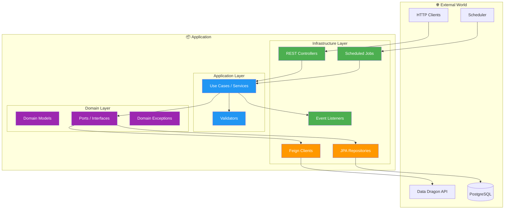
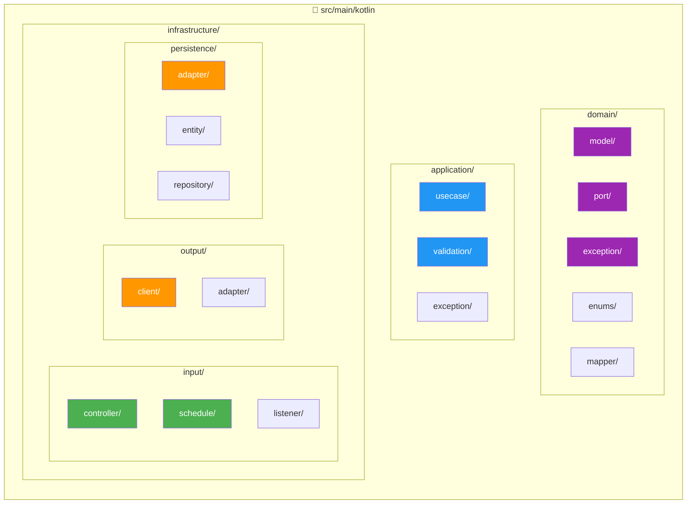
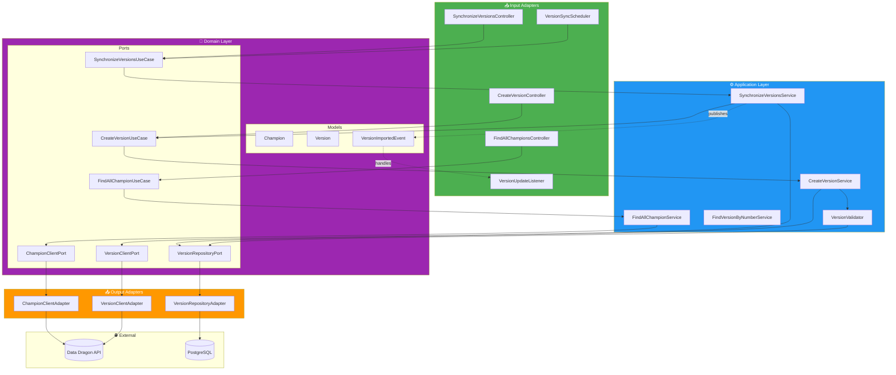
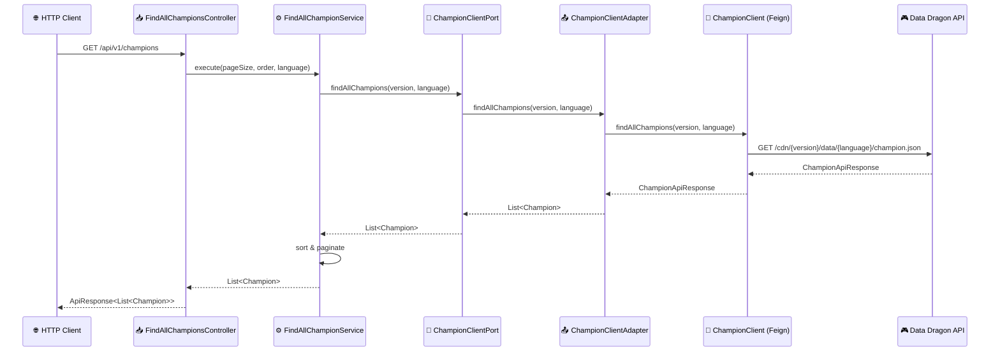
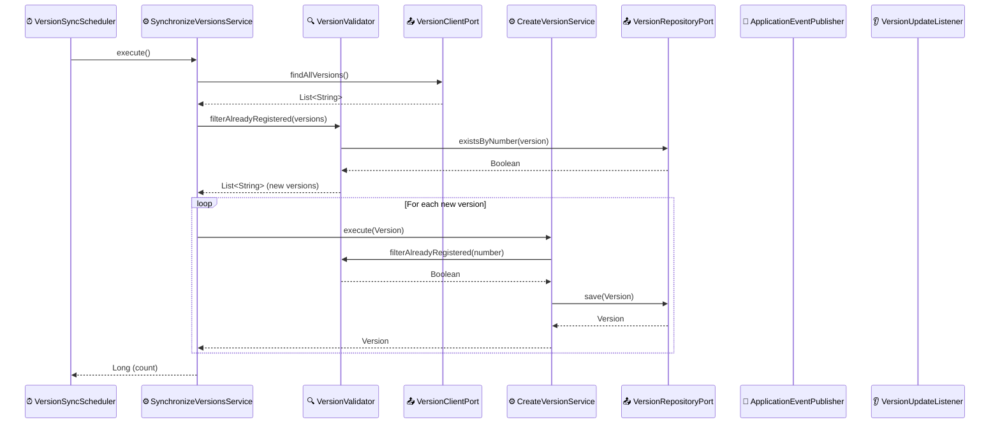
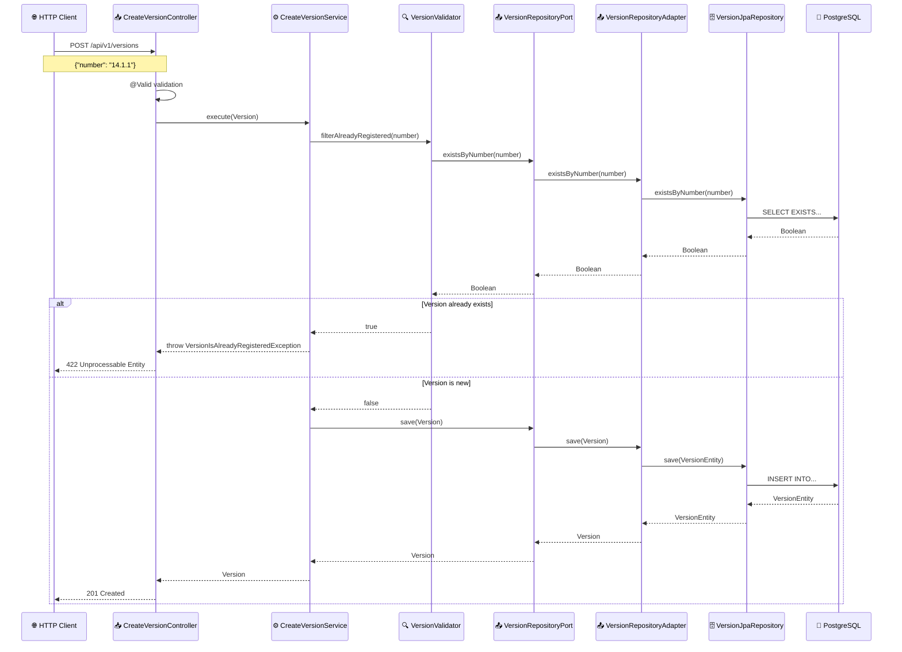
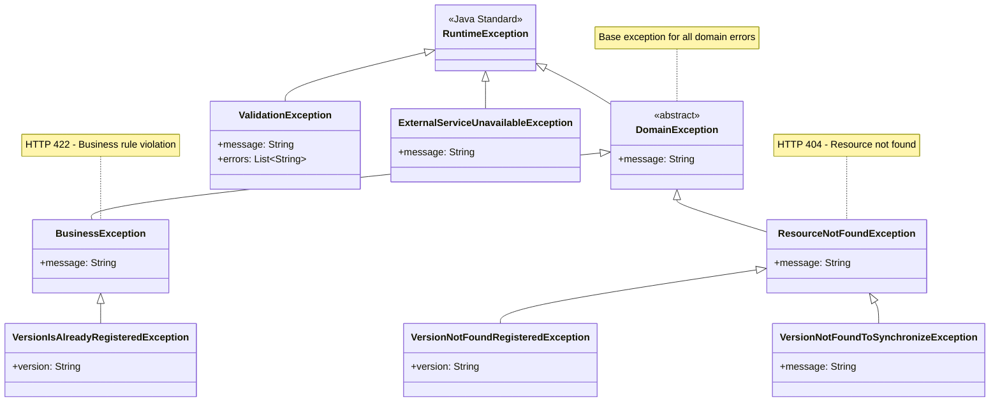
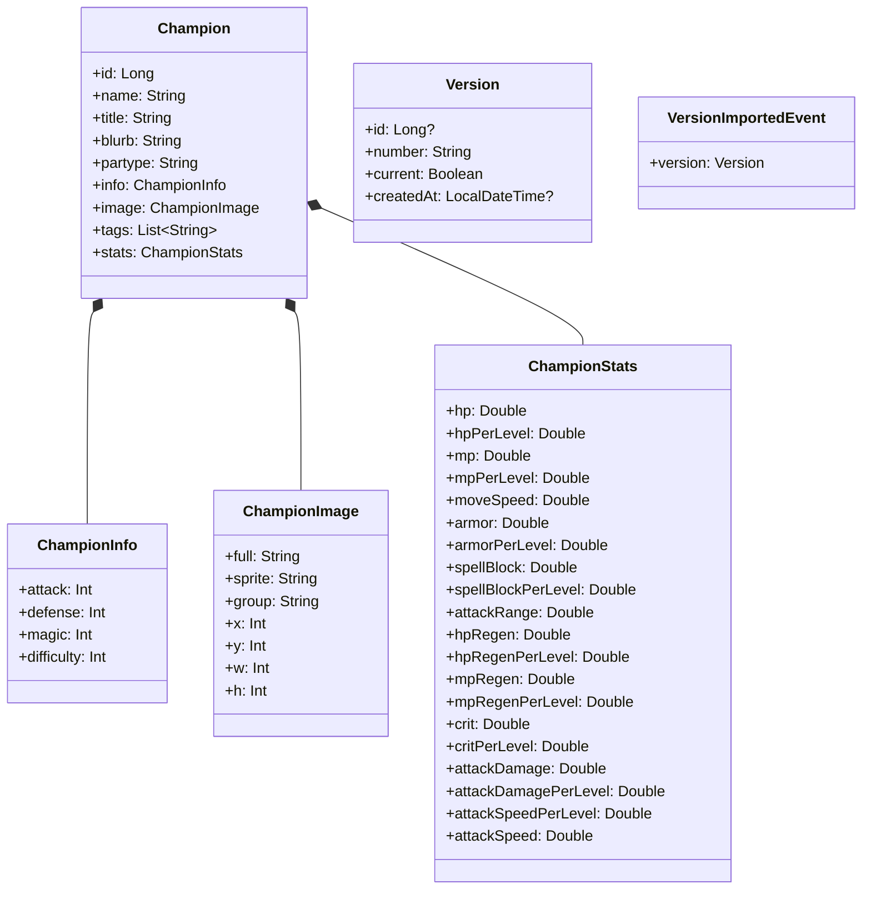
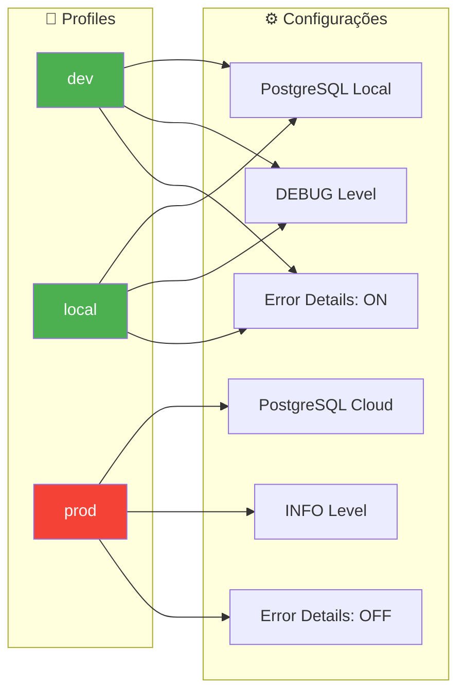

# 🏗️ Arquitetura do Projeto

Este documento descreve a arquitetura do projeto **League of Legends API**, incluindo diagramas de componentes, fluxos e classes.

---

## 📋 Índice

- [Visão Geral](#-visão-geral)
- [Arquitetura Hexagonal](#-arquitetura-hexagonal)
- [Diagrama de Componentes](#-diagrama-de-componentes)
- [Fluxos de Dados](#-fluxos-de-dados)
- [Hierarquia de Exceções](#-hierarquia-de-exceções)
- [Diagrama de Classes](#-diagrama-de-classes)
- [Diagrama de Sequência](#-diagrama-de-sequência)

---

## 🎯 Visão Geral

O projeto implementa uma **Arquitetura Hexagonal** (também conhecida como Ports and Adapters) que separa claramente as responsabilidades em três camadas principais:

---

## 🔷 Arquitetura Hexagonal

### Princípios Aplicados

| Princípio | Descrição | Implementação |
|-----------|-----------|---------------|
| **Inversão de Dependência** | O domínio não conhece a infraestrutura | Ports (interfaces) no domínio |
| **Separação de Concerns** | Cada camada tem responsabilidades claras | Domain, Application, Infrastructure |
| **Testabilidade** | Fácil substituição de implementações | Injeção de dependências via construtor |
| **Independência de Framework** | Domínio livre de anotações Spring | Models e Ports puros |

### Estrutura de Pastas

---

## 🧩 Diagrama de Componentes

---

## 🔄 Fluxos de Dados

### Fluxo: Buscar Campeões

### Fluxo: Sincronizar Versões

### Fluxo: Criar Versão Manualmente

---

## ⚠️ Hierarquia de Exceções

### Mapeamento HTTP

| Exceção | HTTP Status | Código |
|---------|-------------|--------|
| `BusinessException` | 422 Unprocessable Entity | `BUSINESS_ERROR` |
| `ResourceNotFoundException` | 404 Not Found | `RESOURCE_NOT_FOUND` |
| `ValidationException` | 400 Bad Request | `VALIDATION_ERROR` |
| `ExternalServiceUnavailableException` | 503 Service Unavailable | `DEPENDENCY_ERROR` |
| `Exception` (genérica) | 500 Internal Server Error | `UNEXPECTED_ERROR` |

---

## 📊 Diagrama de Classes

### Domain Models

### Use Cases (Ports)

```mermaid
classDiagram
    class FindAllChampionUseCase {
        <<interface>>
        +execute(pageSize: Int, order: OrderType, language: String): List~Champion~
    }

    class CreateVersionUseCase {
        <<interface>>
        +execute(version: Version): Version
    }

    class SynchronizeVersionsUseCase {
        <<interface>>
        +execute(): Long
    }

    class FindVersionByNumberUseCase {
        <<interface>>
        +execute(number: String): Version
    }

    class ExistVersionByNumberUseCase {
        <<interface>>
        +execute(number: String): Boolean
    }

    class ChampionClientPort {
        <<interface>>
        +findAllChampions(version: String, language: String): List~Champion~
    }

    class VersionClientPort {
        <<interface>>
        +findAllVersions(): List~String~
    }

    class VersionRepositoryPort {
        <<interface>>
        +save(version: Version): Version
        +existsByNumber(number: String): Boolean
        +findByNumber(number: String): Version?
        +findCurrentVersion(): Version?
    }
```

---

## 🔧 Configurações

### Profiles de Ambiente

---

## 📚 Referências

- [Hexagonal Architecture - Alistair Cockburn](https://alistair.cockburn.us/hexagonal-architecture/)
- [Clean Architecture - Robert C. Martin](https://blog.cleancoder.com/uncle-bob/2012/08/13/the-clean-architecture.html)
- [Domain-Driven Design - Eric Evans](https://domainlanguage.com/ddd/)
- [Spring Boot Documentation](https://docs.spring.io/spring-boot/docs/current/reference/html/)

---

> 📅 **Última atualização:** 31 de Dezembro de 2025

