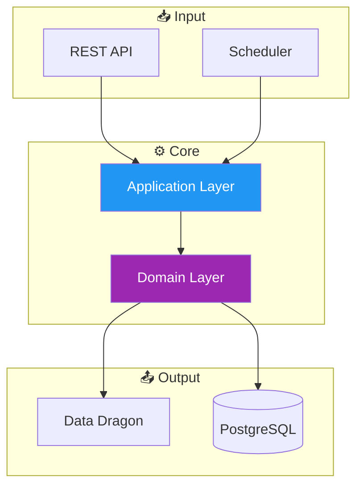

# 📚 Documentação Técnica

Bem-vindo à documentação técnica do projeto **League of Legends API**.

---

## 📋 Índice de Documentos

| Documento | Descrição | Última Atualização |
|-----------|-----------|-------------------|
| [📐 ARQUITETURA.md](ARQUITETURA.md) | Diagramas de arquitetura, componentes, fluxos e classes usando Mermaid | 31/12/2025 |
| [📚 API_REFERENCE.md](API_REFERENCE.md) | Referência completa da API REST com exemplos | 31/12/2025 |
| [📊 RELATORIO_ANALISE_TECNICA.md](RELATORIO_ANALISE_TECNICA.md) | Análise técnica detalhada do projeto | 31/12/2025 |

---

## 🗂️ Estrutura da Documentação

```
docs/
├── README.md                      # Este arquivo (índice)
├── ARQUITETURA.md                 # Diagramas e arquitetura
├── API_REFERENCE.md               # Referência da API
└── RELATORIO_ANALISE_TECNICA.md   # Análise técnica
```

---

## 🎯 Visão Geral do Projeto

O **League of Legends API** é uma API REST que consome dados da [Data Dragon API](https://developer.riotgames.com/docs/lol#data-dragon) da Riot Games para fornecer informações sobre campeões e versões do jogo.

### Principais Características

- 🏗️ **Arquitetura Hexagonal** (Ports and Adapters)
- 🎮 **Integração com Data Dragon API**
- ⏰ **Sincronização automática** de versões (diária)
- 🛡️ **Tratamento global de erros** (RFC 7807)
- 🧪 **Testes automatizados** (unitários + integração)

---

## 📊 Diagramas Disponíveis

### Arquitetura



Para diagramas completos, consulte [ARQUITETURA.md](ARQUITETURA.md).

---

## 🔗 Links Úteis

### Internos
- [README principal](../README.md)
- [CHANGELOG](../CHANGELOG.md)

### Externos
- [Data Dragon API](https://developer.riotgames.com/docs/lol#data-dragon)
- [Spring Boot](https://docs.spring.io/spring-boot/docs/current/reference/html/)
- [Kotlin](https://kotlinlang.org/docs/home.html)
- [Mermaid](https://mermaid.js.org/intro/)

---

## 📝 Convenções

### Idioma
- **Código e comentários**: Inglês (en-EN)
- **Documentação**: Português (pt-BR)

### Versionamento
- Seguimos [Semantic Versioning](https://semver.org/lang/pt-BR/)
- Changelog segue [Keep a Changelog](https://keepachangelog.com/pt-BR/1.0.0/)

### Diagramas
- Utilizamos [Mermaid](https://mermaid.js.org/) para diagramas
- Tipos: flowchart, sequence, class, pie, timeline

---

> 📅 **Última atualização:** 31 de Dezembro de 2025  
> 📌 **Versão do Projeto:** 1.2.0

