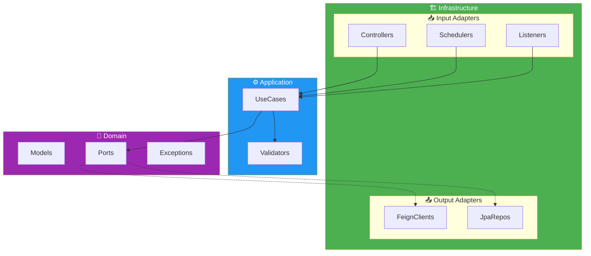
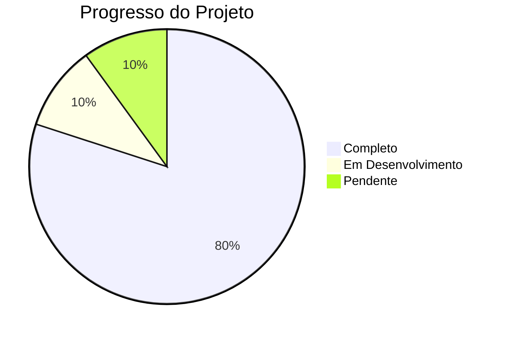
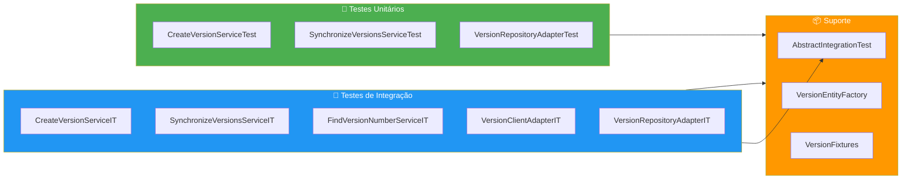
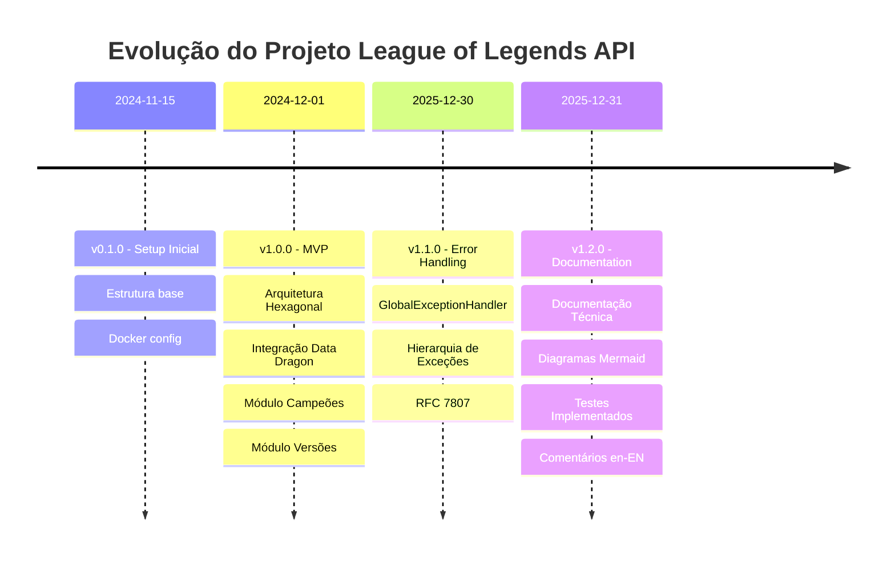

# 📊 Relatório de Análise Técnica do Projeto

**Projeto:** League of Legends API  
**Data:** 31 de Dezembro de 2025  
**Status:** 🚧 Em Desenvolvimento  
**Versão:** 1.3.0

---

## 📋 Sumário Executivo

Este relatório apresenta uma análise técnica profunda do projeto **League of Legends API**, avaliando arquitetura, código, padrões utilizados, pontos fortes, pontos de melhoria e recomendações para as próximas etapas de desenvolvimento.

---

## 1. 🏗️ Análise da Arquitetura

### 1.1 Arquitetura Implementada: Hexagonal (Ports & Adapters)

O projeto implementa corretamente a **Arquitetura Hexagonal** com clara separação em três camadas:

| Camada | Pacote | Responsabilidade |
|--------|--------|------------------|
| **Domain** | `domain/` | Regras de negócio, modelos e interfaces (ports) |
| **Application** | `application/` | Casos de uso e validadores |
| **Infrastructure** | `infrastructure/` | Adapters (controllers, clients, repositories) |

#### ✅ Pontos Fortes da Arquitetura

1. **Inversão de Dependência (DIP)**: O domínio não conhece a infraestrutura
2. **Ports bem definidos**: Interfaces claras para entrada (`input/`) e saída (`output/`)
3. **Adapters isolados**: Feign Clients e JPA separados em seus respectivos pacotes
4. **Testabilidade**: Fácil substituição de implementações por mocks
5. **Tratamento de Erros Global**: `GlobalExceptionHandler` centralizado

### 1.2 Diagrama de Dependências



---

## 2. 📦 Análise dos Componentes

### 2.1 Domain Layer

#### Models (Entidades de Domínio)

| Modelo | Linhas | Avaliação |
|--------|--------|-----------|
| `Champion` | 28 | ✅ Bem documentado com KDoc |
| `ChampionStats` | 83 | ✅ Documentado com KDoc em inglês |
| `ChampionImage` | 23 | ✅ Simples e coeso |
| `ChampionInfo` | 17 | ✅ Bem estruturado |
| `Version` | 8 | ✅ Minimalista e funcional |
| `VersionImportedEvent` | 4 | ✅ Evento de domínio bem definido |

#### Exceções de Domínio

| Exceção | HTTP Status | Descrição |
|---------|-------------|-----------|
| `DomainException` | - | Base abstrata |
| `BusinessException` | 422 | Regras de negócio |
| `ResourceNotFoundException` | 404 | Recurso não encontrado |
| `ValidationException` | 400 | Erros de validação |
| `ExternalServiceUnavailableException` | 503 | Serviço externo indisponível |

#### Ports (Interfaces)

**Input Ports (Use Cases):**
| Interface | Implementação | Status |
|-----------|---------------|--------|
| `FindAllChampionUseCase` | `FindAllChampionService` | ✅ |
| `CreateVersionUseCase` | `CreateVersionService` | ✅ |
| `SynchronizeVersionsUseCase` | `SynchronizeVersionsService` | ✅ |
| `ExistVersionByNumberUseCase` | `FindVersionByNumberService` | ✅ |
| `FindVersionByNumberUseCase` | `FindVersionByNumberService` | ✅ |

**Output Ports (Repositórios/Clients):**
| Interface | Adapter | Status |
|-----------|---------|--------|
| `ChampionClientPort` | `ChampionClientAdapter` | ✅ |
| `VersionClientPort` | `VersionClientAdapter` | ✅ |
| `VersionRepositoryPort` | `VersionRepositoryAdapter` | ✅ |

### 2.2 Application Layer

#### Use Cases

| Service | Responsabilidade | Testes | Qualidade |
|---------|------------------|--------|-----------|
| `FindAllChampionService` | Busca campeões com ordenação | 🚧 | ✅ Boa |
| `CreateVersionService` | Cria nova versão | ✅ | ✅ Boa |
| `SynchronizeVersionsService` | Orquestra sincronização | ✅ | ✅ Excelente |
| `FindVersionByNumberService` | Busca versão por número | ✅ | ✅ Boa |

### 2.3 Infrastructure Layer

#### Input Adapters

**Controllers:**

| Controller | Endpoint | Método HTTP | Avaliação |
|------------|----------|-------------|-----------|
| `FindAllChampionsController` | `/api/v1/champions` | GET | ✅ |
| `SynchronizeVersionsController` | `/api/v1/admin/versions/import` | POST | ✅ |
| `CreateVersionController` | `/api/v1/versions` | POST | ✅ |

**Exception Handlers:**

| Handler | Responsabilidade | Status |
|---------|------------------|--------|
| `GlobalExceptionHandler` | Tratamento centralizado | ✅ Implementado |
| `ApiErrorResponseFactory` | Criação de respostas de erro | ✅ Implementado |

**Schedulers:**
| Scheduler | Frequência | Avaliação |
|-----------|------------|-----------|
| `VersionSyncScheduler` | Diário 04:00 | ✅ Excelente |

**Event Listeners:**
| Listener | Evento | Avaliação |
|----------|--------|-----------|
| `VersionUpdateListener` | `VersionImportedEvent` | ✅ Bem implementado |

---

## 3. 📈 Métricas do Projeto

### 3.1 Estatísticas de Código

| Métrica | Valor |
|---------|-------|
| **Arquivos Kotlin** | ~69 |
| **Linhas de código (estimado)** | ~1200 |
| **Entidades de domínio** | 6 |
| **Use Cases** | 5 |
| **Controllers** | 3 |
| **Endpoints REST** | 3 |
| **Feign Clients** | 2 |
| **JPA Entities** | 1 |
| **Schedulers** | 1 |
| **Event Listeners** | 1 |
| **Testes Unitários** | 4 |
| **Testes de Integração** | 5 |

### 3.2 Qualidade de Código (SonarQube)

#### Métricas Atuais

| Métrica | Valor | Status |
|---------|-------|--------|
| **Quality Gate** | Passed | ✅ |
| **Line Coverage** | 27.25% | ⚠️ |
| **Branch Coverage** | 15.22% | ⚠️ |
| **Instruction Coverage** | 21.09% | ⚠️ |
| **Method Coverage** | 22.56% | ⚠️ |
| **Class Coverage** | 43.4% | ⚠️ |
| **Bugs** | 0 | ✅ |
| **Code Smells** | 0 | ✅ |
| **Vulnerabilities** | 0 | ✅ |
| **Security Hotspots** | 0 | ✅ |
| **Duplicated Lines** | 0% | ✅ |
| **Technical Debt** | 0min | ✅ |

> ⚠️ **Cobertura abaixo da meta de 80%** - Necessário adicionar mais testes

#### Configuração SonarQube

| Configuração | Valor |
|--------------|-------|
| **Plugin Version** | 7.2.0.6526 |
| **Project Key** | `league-of-legends` |
| **Project Name** | `League of Legends API` |
| **Host URL** | `http://localhost:9000` |

#### Configuração JaCoCo

| Configuração | Valor |
|--------------|-------|
| **Report Format** | XML + HTML |
| **XML Path** | `build/reports/jacoco/test/jacocoTestReport.xml` |
| **HTML Path** | `build/reports/jacoco/test/html/index.html` |

### 3.3 Cobertura de Funcionalidades



| Funcionalidade | Status | Progresso |
|----------------|--------|-----------|
| Arquitetura Hexagonal | ✅ Completo | 100% |
| Listagem de Campeões | ✅ Completo | 100% |
| Sincronização de Versões | ✅ Completo | 100% |
| Sistema de Eventos | ✅ Completo | 100% |
| Agendamento de Jobs | ✅ Completo | 100% |
| Docker/Docker Compose | ✅ Completo | 100% |
| Tratamento de Erros | ✅ Completo | 100% |
| Testes Unitários | ✅ Completo | 100% |
| Testes de Integração | ✅ Completo | 100% |
| SonarQube | ✅ Completo | 100% |
| JaCoCo | ✅ Completo | 100% |
| Documentação Técnica | ✅ Completo | 100% |
| Documentação OpenAPI | 🚧 Pendente | 0% |
| Autenticação/Autorização | 🚧 Pendente | 0% |
| Cache | 🚧 Pendente | 0% |

---

## 4. 🔍 Análise Detalhada de Código

### 4.1 Boas Práticas Identificadas ✅

| Prática | Local | Exemplo |
|---------|-------|---------|
| **Data Classes** | Models | `data class Champion(...)` |
| **KDoc Documentation (en-EN)** | Domain | Comentários estruturados em inglês |
| **Extension Functions** | Mappers | `ChampionDetailResponse.toChampion()` |
| **Sealed/Enum Classes** | Enums | `enum class OrderType` |
| **Injeção via Construtor** | Services | Constructor injection |
| **Single Responsibility** | Use Cases | Um caso de uso por classe |
| **Transações Declarativas** | Services | `@Transactional` |
| **Logging Estruturado** | Scheduler | Logger com SLF4J |
| **runCatching** | Scheduler | Tratamento funcional de erros |
| **Spring Events** | Domain | Event-driven architecture |
| **Global Exception Handler** | Infrastructure | `@RestControllerAdvice` |
| **Error Factory Pattern** | Infrastructure | `ApiErrorResponseFactory` |

### 4.2 Melhorias Implementadas na v1.2.0 ✅

| Melhoria | Descrição |
|----------|-----------|
| Tratamento de Erros Global | `GlobalExceptionHandler` com `@RestControllerAdvice` |
| Hierarquia de Exceções | `DomainException` → `BusinessException` / `ResourceNotFoundException` |
| Respostas Padronizadas | `ApiErrorResponse` seguindo RFC 7807 |
| Proteção em Produção | Detalhes de erro ocultos fora de `dev`/`local` |
| Comentários em Inglês | Todos os KDocs traduzidos para en-EN |
| Documentação Técnica | Diagramas Mermaid em `/docs` |

### 4.3 Melhorias Implementadas na v1.3.0 ✅

| Melhoria | Descrição |
|----------|-----------|
| Endpoint Corrigido | `SynchronizeVersionsController` agora usa `POST` |
| Network Corrigida | `docker-compose.yml` usa `lol-network` |
| Dockerfile Atualizado | JRE 21 em vez de JRE 17 |
| Novos Testes | Testes para adapters adicionados |
| SonarQube | Plugin configurado para análise de código |

### 4.4 Melhorias Futuras 🟢

| # | Sugestão | Local |
|---|----------|-------|
| 1 | Implementar paginação real | `FindAllChampionService` |
| 2 | Cache para API externa | `ChampionClientAdapter` |
| 3 | Adicionar OpenAPI/Swagger | Controllers |
| 4 | Rate limiting | Controllers |
| 5 | Métricas com Micrometer | Aplicação |

---

## 5. 🧪 Análise de Testes

### 5.1 Testes Implementados



### 5.2 Cobertura de Testes

| Componente | Unitário | Integração | Status |
|------------|----------|------------|--------|
| `CreateVersionService` | ✅ | ✅ | Completo |
| `SynchronizeVersionsService` | ✅ | ✅ | Completo |
| `FindVersionByNumberService` | - | ✅ | Parcial |
| `VersionRepositoryAdapter` | ✅ | ✅ | Completo |
| `VersionClientAdapter` | - | ✅ | Parcial |
| `FindAllChampionService` | - | - | Pendente |
| Controllers | - | - | Pendente |

---

## 6. 🛡️ Análise de Segurança

| Aspecto | Status | Observação |
|---------|--------|------------|
| SQL Injection | ✅ Protegido | Spring Data JPA usa PreparedStatements |
| Autenticação | 🚧 Ausente | Endpoints públicos |
| HTTPS | 🚧 Não configurado | - |
| Rate Limiting | 🚧 Ausente | Vulnerável a DDoS |
| Validação de Input | ✅ Implementado | `@Valid` nos controllers |
| Proteção de Detalhes | ✅ Implementado | Erros ocultos em produção |

---

## 7. 📋 Roadmap Atualizado

### Sprint Atual - Documentação ✅ (Concluído)
```
├── [x] Padronização de comentários em inglês
├── [x] Documentação técnica com Mermaid
├── [x] Atualização do README.md
└── [x] Atualização do CHANGELOG.md
```

### Próxima Sprint - API Documentation
```
├── [ ] Adicionar SpringDoc OpenAPI
├── [ ] Documentar todos os endpoints
├── [ ] Adicionar Swagger UI
└── [ ] Gerar cliente SDK
```

### Sprint Seguinte - Performance
```
├── [ ] Implementar cache Redis/Caffeine
├── [ ] Otimizar queries N+1
├── [ ] Adicionar índices no banco
└── [ ] Configurar connection pool
```

---

## 8. 📝 Conclusão

### Pontos Fortes do Projeto

1. **Arquitetura sólida** - Hexagonal bem implementada
2. **Código Kotlin idiomático** - Bom uso dos recursos da linguagem
3. **Separação de responsabilidades** - Cada classe tem um propósito claro
4. **Event-driven** - Desacoplamento via eventos de domínio
5. **Automação** - Jobs agendados funcionais
6. **Tratamento de Erros** - Sistema global implementado ✅
7. **Testes** - Base de testes iniciada ✅
8. **Documentação** - Técnica completa com diagramas ✅

### Evolução do Projeto



### Avaliação Geral

| Critério | Nota | Comentário |
|----------|------|------------|
| Arquitetura | ⭐⭐⭐⭐⭐ | Excelente |
| Código | ⭐⭐⭐⭐⭐ | Excelente |
| Testes | ⭐⭐⭐ | Bom (em progresso) |
| Documentação | ⭐⭐⭐⭐⭐ | Excelente |
| Segurança | ⭐⭐⭐ | Razoável |
| **Média** | **⭐⭐⭐⭐** | **Muito Bom** |

---

**O projeto evoluiu significativamente e agora possui uma base sólida com tratamento de erros, testes e documentação técnica completa. As próximas etapas devem focar em documentação OpenAPI, cache e segurança.**

---

*Relatório atualizado em 31/12/2025*  
*Versão: 1.2.0*
